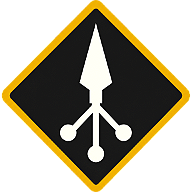

<p align="center">
  
</p>

# Warparty

Warparty is a small private web app for coordinating Diablo-style War Plan routes with a party.

Each player joins the same Warparty, enters their own ordered War Plan, tracks their own progress,
and follows the recommended shared route so the group can finish everyone's plan with fewer wasted
runs.

Warparty is not affiliated with Blizzard Entertainment.

## What It Does

- Create a private Warparty.
- Invite players with a join link or short invite code.
- Support one Diablo party: 4 player slots.
- Let each player edit only their own War Plan and progress.
- Let the party leader remove players and reopen slots.
- Recalculate the recommended route as plans and progress change.
- Update connected party pages in real time.
- Store everything in SQLite under `/data` when running in Docker.

Supported activities:

- Helltide
- Pit
- Nightmare Dungeon
- Infernal Hordes
- Lair Boss
- Kurast Undercity

## Run Locally

Install [uv](https://docs.astral.sh/uv/), then run:

```bash
./scripts/dev-start.sh
```

On Windows:

```bat
scripts\dev-start.bat
```

Open:

```text
http://localhost:8080
```

Local data is stored in `data/warparty.db`. The dev scripts keep the server attached to the
terminal so logs are visible. Press `Ctrl+C` to stop.

Manual commands:

```bash
uv sync --extra dev
uv run uvicorn app.main:app --host 127.0.0.1 --port 8080 --reload
```

Run checks:

```bash
uv run ruff check .
uv run black --check .
uv run pytest
```

## Run With Docker

Using the published image:

```bash
docker run --rm \
  -p 8080:8080 \
  -e WARPARTY_PUBLIC_BASE_URL=http://localhost:8080 \
  -v warparty-data:/data \
  ghcr.io/landmine-1252/warparty:latest
```

Then open:

```text
http://localhost:8080
```

Build locally instead:

```bash
docker build -t warparty .
docker run --rm \
  -p 8080:8080 \
  -e WARPARTY_PUBLIC_BASE_URL=http://localhost:8080 \
  -v warparty-data:/data \
  warparty
```

Or use Compose:

```bash
docker compose up --build
```

## Data

The container stores runtime data in `/data`:

- `/data/warparty.db`
- `/data/secret_key`

Use a Docker named volume or bind mount for `/data` if you want parties to survive container
updates.

Example bind mount:

```bash
mkdir -p ./data
docker run --rm \
  -p 8080:8080 \
  -e WARPARTY_PUBLIC_BASE_URL=http://localhost:8080 \
  -v "$(pwd)/data:/data:rw" \
  ghcr.io/landmine-1252/warparty:latest
```

Back up the mounted `/data` directory before upgrading if you care about active parties.

## Configuration

Most deployments only need one environment variable:

| Variable | Default | Notes |
| --- | --- | --- |
| `WARPARTY_PUBLIC_BASE_URL` | `http://localhost:8080` | Used to build invite links. Set this to your real external URL when running behind a proxy. |

Optional runtime settings:

| Variable | Default | Notes |
| --- | --- | --- |
| `WARPARTY_LOG_LEVEL` | `info` | Uvicorn/application log level. |
| `WARPARTY_PORT` | `8080` | Container listen port. |
| `WARPARTY_COOKIE_SECURE` | true for HTTPS public URLs | Controls the session cookie `Secure` flag. |
| `WARPARTY_SQLITE_BUSY_TIMEOUT_MS` | `5000` | SQLite lock wait timeout. |
| `WARPARTY_SQLITE_WAL` | `true` | Enables SQLite WAL mode. |
| `WARPARTY_STALE_PLAYER_MINUTES` | `60` | When a player is shown as stale. |

## Healthcheck

```text
GET /healthz
GET /readyz
```

`/readyz` also checks SQLite.

## Notes

Warparty is designed for a single small party app container. SQLite and in-process WebSockets are
the right fit for that. If you want to run multiple app containers at the same time, move the data
and real-time event layer to shared services first.
